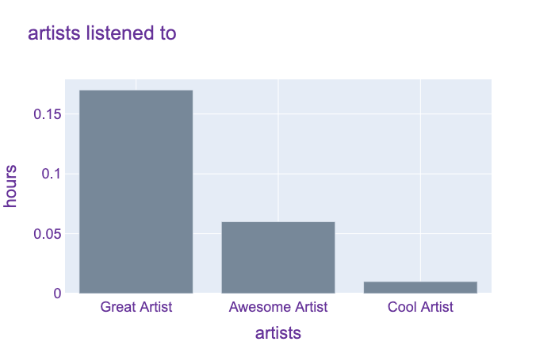

<p align="center">
  <h3 align="center">Visualize Personal Spotify Data</h3>
  <p align="center">
    Plot how much time you spent listening to certain artists & tracks. 
    <br />
</p>


### Built With

* [Plotly](https://github.com/plotly)

## Getting Started

To get a local copy up and running follow these simple steps.


### Installation

1. Request your personal data from Spotify <a href="https://support.spotify.com/us/article/data-rights-and-privacy-settings/">(How to request personal data from Spotify?)</a>
2. Clone the repo
   ```sh
   git clone git@github.com:mudassarzahid/visualize-personal-spotify-data.git
   ```
2. After downloading your personal data, make sure the <i>StreamingHistory.json</i> file is in the same directory as <i>app.py</i>. Replace <i>example_data.json</i> with <i>StreamingHistory.json</i>.
3. Install required modules and run the app
   ```sh
   cd visualize-personal-spotify-data
   pip install -r requirements.txt
   python app.py
   ```


## Usage example
<span align="center">

</span>
